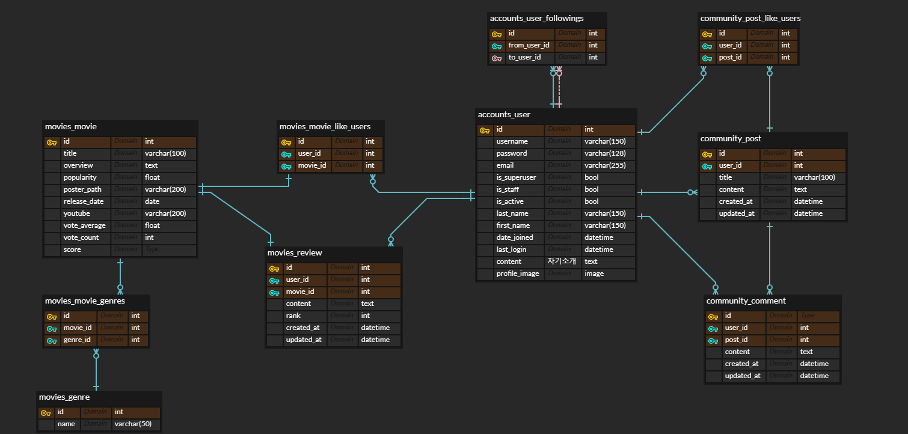

# CornFlix

2023 1학기 SSAFY Final 관통프로젝트 : 영화 추천 사이트
  

## 👨‍💻 팀원 소개 및 분담 내역  

<table>
  <tbody>
    <tr>
      <td align="center"><a href="https://github.com/se0987"> <b>백승은(se0987)</b></a> <a href="#maintenance-flaxinger" title="Maintenance">🚧</a></td>
      <td align="center"><a href="https://github.com/FantBlog"> <b>박성욱(FantBlog)</b></a> <a href="https://github.com/BaekjoonHub/BaekjoonHub/commits?author=cokemania2" title="Code">💻</a></td>    </tr>
  </tbody>
</table>

- 박성욱
> 데이터 베이스 모델링(ERD) 설계, 백엔드 Django api 설계 및 개발, 영화 추천 알고리즘 및 관련 알고리즘 개발, 
> Vue 전체적인 Vuex, api(Axios) 개발

- 백승은
> Views, component 설계 및 개발, router 개발, 페이지 목업 설계 & 전체 프로젝트 디자인

 

## 🗓️  프로젝트 일정  

- 2023.05.16 ~ 2023.05.26(총10일)

[Final 관통프로젝트 일지](https://www.notion.so/PJT-fcd3fd062f4846aa92f044197db2ef6c?pvs=4)

 

## 🎞  목표 서비스  

### ❇️ 초기구상 목업

### 🚩 구현 목표 ✅❎
1. 회원 가입 ✅
- 회원가입, 로그인, 로그아웃
- 비로그인 시 특정 페이지 접근 불가, 로그인 페이지 이동
- 회원가입, 로그인, 로그아웃 시 페이지 이동

 

2. 영화 정보 ✅
- 영화 데이터 50개 이상 가져오기 
- 영화 리뷰 생성, 수정, 삭제
  - 별점(평점)
  - 프로필 사진 보이기 ⭐
- 영화 추천
- 영화 리스트 회전하며 보여주기 (롤링/캐러셀)

 

3. 영화 추천 알고리즘 ✅
- 최신영화
- 추천영화
- 관련영화

 

4. 커뮤니티 ✅
- 게시글 생성, 수정, 삭제
- 댓글 생성, 수정, 삭제

 

5. 프로필 ✅
- 프로필 사진 ⭐
- 좋아요 한 영화 목록
- 나의 게시글/댓글 목록
- 추천 영화 목록

 

6. 기타

 

## 🎫   데이터베이스 모델링 (ERD) 

 

## 🎟    API 설계 

| HTTP verb | URL패턴            | 설명                                                 |
| --------- | ------------------ | --------------------------------------------------- |
|           | `admin/`           | admin.site.urls                                     |
|           | `movies/`          | include('movies.urls')                              |
|           | `community/`       | include('communitys.urls')                          |
|           | `user/`            | include("accounts.urls")                            |
|           | `accounts/`        | include('dj_rest_auth.urls')                        |
|           | `accounts/signup/` | include('dj_rest_auth.registration.urls')           |

| HTTP verb | URL 패턴                          | 설명                       |
| --------- | --------------------------------- | ------------------------- |
| GET, PUT  | `user/profile/<str:user_name>/`   | 유저 프로필 조회, 수정      |
| POST      | `user/<str:user_name>/follow/`    | 유저 팔로우                |

| HTTP verb        | URL 패턴                                  | 설명                        |
| ---------------- | ----------------------------------------- | -------------------------- |
| GET, POST        | `community/posts/`                        | 게시글 전체 조회, 생성       |
| GET, PUT, DELETE | `community/posts/<int:post_pk>/`          | 상세 게시글 조회, 수정, 삭제 |
| POST             | `community/posts/<int:post_pk>/like/`     | 게시글 좋아요               |
| GET, POST        | `community/posts/<int:post_pk>/comments/` | 댓글 전체 조회, 생성         |
| PUT, DELETE      | `community/comments/<int:comment_pk>/`    | 댓글 수정, 삭제             |

| HTTP verb | URL 패턴                                                     | 설명                              |
| --------- | ------------------------------------------------------------ | --------------------------------- |
| GET       | `movies/`                                                    | 영화 전체 목록 조회                |
| GET       | `movies/<int:movie_pk>/`                                     | 상세 영화 조회                     |
| POST      | `movies/<int:movie_pk>/like/`                                | 유저의 좋아요                      |
| GET, POST | `movies/<int:movie_pk>/reviews/`                             | 리뷰 전체 조회 및 작성             |
| PUT, DELETE | `movies/reviews/<int:review_pk>/`                          | 리뷰 수정 및 삭제                  |
| GET       | `movies/relate/<int:movie_pk>/`                              | 특정 영화의 관련 영화 조회          |
| GET       | `movies/recent/<int:page>/`                                  | 최신 영화 조회                     |
| GET       | `movies/recommend/<int:page>/`                               | 추천 영화 조회                     |
| GET       | `movies/genre/<int:genre_id>/<int:page>/`                    | 특정 장르 영화 조회                |

 

## 🎬  영화 추천 알고리즘 

- ### 영화 추천 시스템
영화 추천 시스템를 만들기위해 TMDB Ratings를 사용했습니다.

IMDB의 weighted rating 공식을 사용하여 차트를 구성합니다.
수학적으로는 다음과 같이 표현됩니다.

Weighted Rating $WR =(\frac{v}{v+m}·R)+(\frac{m}{v+m}·C)$
 
v : 영화에 대한 평가 수   
m : 차트에 표시되어야 하는 최소 평가 수   
R : 영화의 평점   
C : 전체 영화에 대한 평균 점수   

 

- ### 관련 영화 시스템

?영화 총 개수 만개?
영화 상세 설명 사이의 코사인 유사도를 분석

 

## ✨  서비스 대표 기능 

 

## 📕  후기 
- 박성욱
> 

- 백승은
> 